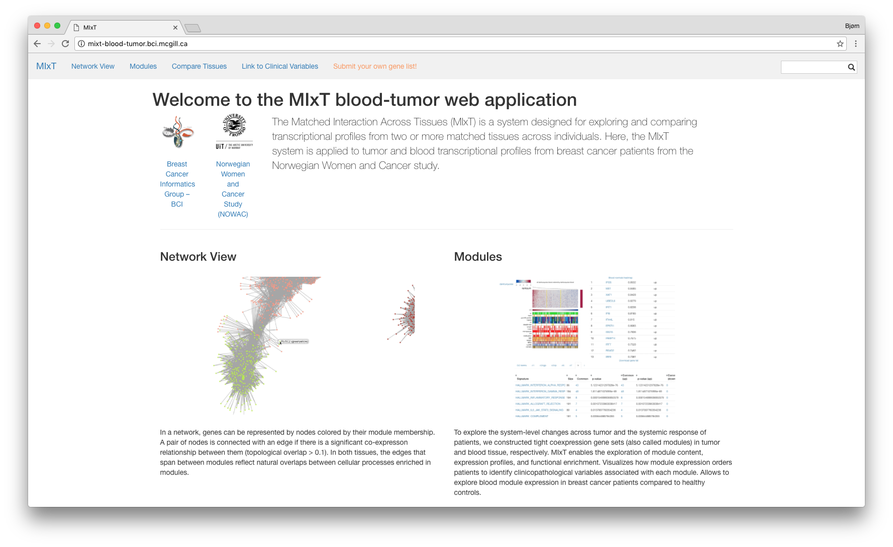

# MIxT
The Matched Interaction Across Tissues (MIxT) is a system designed for exploring
and comparing transcriptional profiles from two or more matched tissues across
individuals. Here, the MIxT system is applied to tumor and blood transcriptional
profiles from breast cancer patients from the Norwegian Women and Cancer study.

Users can browse through all the results generated for this study, visualize
gene co-expression networks and expression heatmaps, and search for genes, gene
lists, and pathways. 

The application runs at [mixt-blood-tumor.bci.mcgill.ca](http://mixt-blood-tumor.bci.mcgill.ca). 

 

# System
MIxT consist of two main components: the web application and the
compute backend. The compute backend provides data and analyses, and the web
application allows users to view and explore the results. We use the *r* package
in [Kvik](http://github.com/fjukstad/kvik) to run the compute backend. 

# Install and run 
There are two options for installing and running the MIxT web
application, either compile and run on your machine, or use the Docker Image. 

## Compile and run 
- First install [go](http://golang.org)
- `$ go get github.com/fjukstad/mixt`
- `$ cd $GOPATH/src/github.com/fjukstad/mixt`
- `$ mixt `
- Open [localhost:8004](localhost:8004) 

## Docker
- Install [Docker](http://docker.com) 
- `$ docker run -p 8004:80 fjukstad/mixt` 
- Open [localhost:8004](localhost:8004) 

