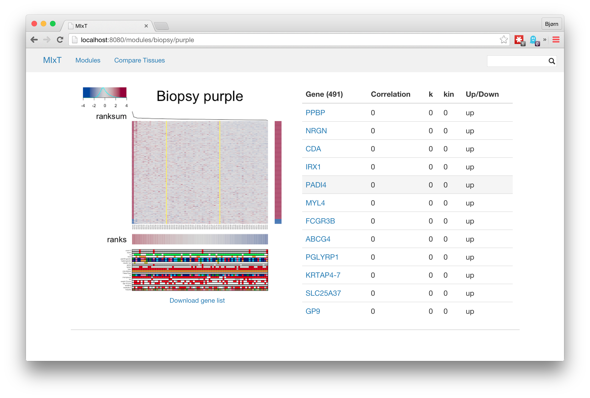

# MIxT

*Bjørn Fjukstad - bjorn@cs.uit.no* 

*26.02.2015*

This the re-write of the MIxt web application. The application is written in
the [Go programming language](http://golang.org) using bits and pieces from the
[Kvik](http://github.com/fjukstad/kvik) framework to provide an interface to
statistical analyses in R and information about genes from
[GeneCards](http://genecards.org). 


 

## System 
MIxT consists of two main components: the a web application and a compute
backend. The web application allows users to browse through modules and
investigate genes from the statistical analyses run by the compute backend. 

### Web Application
The web application tries to mimic most of the functionality from the original
MIxT website at
[bci.mcgill.ca/cc1/index.php](http://www.bci.mcgill.ca/cc1/index.php). Users can
browse through the modules from different tissues (blood or biopsy), look at
heatmaps and information about the genes in those modules. Users can also search
for genes and locate the modules they are found in. To provide information about
genes we have integrated it with Gene Summaries from GeneCards. 

The web application follows the typical [Model-view-controller
(MVC)](http://en.wikipedia.org/wiki/Model%E2%80%93view%E2%80%93controller)
pattern. You'll find views in the [views](/views) directory, controllers in the
[controllers](/controllers) directory and the model in the [mixt](/mixt) folder.
Other resources such as Javascript or CSS files are located in the
[public](/public) folder.

The views are built using the [template
package](http://golang.org/pkg/text/template/) in go (Note that when we're
talking about go we are talking about the programming language go, not Gene
Ontology (GO)). 

Most interesting about the web application is the [script.r](/scripts/script.r)
file. This file contains the necessary R functions to provide the web
application with results from the analyses. As an example, take a look at the
`heatmap` function in the [script.r](/scripts/script.r) file. This file
generates a heatmap (both png and pdf) and returns the filename of the heatmap.
The web application can then retrieve the generated plot and present it to the
user. 

To start the web application simply run 

```
go run main.go
```

in a termal. This assumes that you have installed the [Go programming
language](http://golang.org) on your computer and the necessary dependencies
have been installed. 

### Compute Backend 
The compute backend is a part of the Kvik framework. It provides an
[RPC](http://en.wikipedia.org/wiki/Remote_procedure_call) interface to a R
session, so that the web applications can perform analyses whenever it wants.
You can think of it as a remote R instance that you control from the web
application. When you access a module page in the web application, a function
call to the `heatmap()` function is sent to the backend. The backend executes
the `heatmap` function and returns the results back to the web application. In
the case of the `heatmap` function is a filename which the web application
transforms into a URL and places on the web site so that users can view the
module. 

The compute backend consists of two main components: the master and its many
workers. The master is in charge of starting up workers (each with its own R
session) that can be used by the web application. A worker is just a small
Python program that runs a R session and has an RPC interface which the web
application uses to request it to run different functions. In addition to the
R session it also has a web server running, making it possible to serve the
output files it generates. For example, it serves heatmap images and gene list
tables out of this web server. 

When the web application starts up it contacts the master and requests for it to
start up a worker. The web application sends the [script.r](/scripts/script.r)
file along with the request. The worker starts up by sourcing this file so that
it can execute any of the functions included in the file. It then waits for
incoming function calls and executes them as they arrive. 

As of today the compute backed is started by running the command

```
go run $GOPATH/src/github.com/fjukstad/kvik/compute/compute.go 
```

but with future versions of Kvik this will change. 

### Warnings etc. 
The workers in the compute backend has a tendency to fail if the number of
workers running on the machine gets large (>100). Since the web application only
starts one worker this will only occur when the web application has restarted
several times without restarting the compute backend. 

### Dependencies 
So far, here's a list of dependencies I'm aware about: 

- Go programming language
- Python version > 2.7.0
- [Kvik framework](https://github.com/fjukstad/kvik)
- [ZeroMQ](http://zeromq.org/intro:get-the-software) and language bindings for
  [Python](http://zeromq.org/bindings:python) and
  [Go](http://zeromq.org/bindings:go). ZeroMQ is used for communication between
  the web application and the compute backend. 
